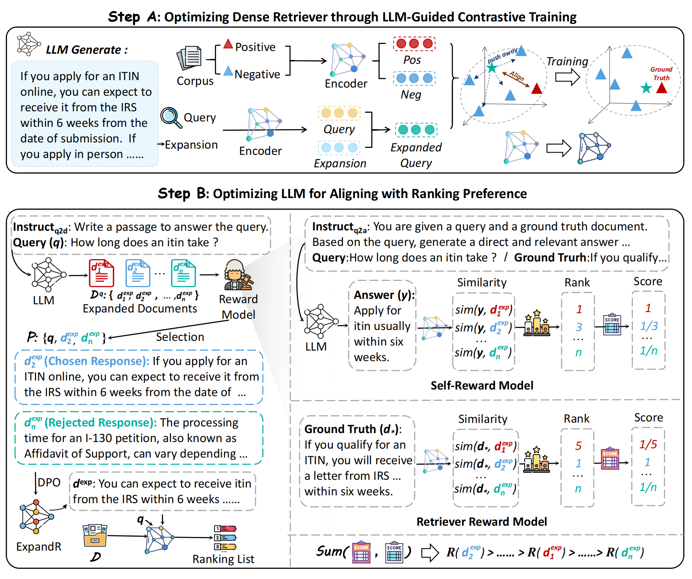

# ExpandR: Teaching Dense Retrievers Beyond Queries with LLM Guidance

[](https://github.com/NEUIR/ExpandR)
[](https://arxiv.org/abs/2502.17057)
[](https://huggingface.co/yaosijiaaaaa/LLM-QE-DPO)
[](https://huggingface.co/yaosijiaaaaa/LLM-QE-Contriever)
[](https://huggingface.co/datasets/chengpingan/LLM-QE-DPO-Training-Data)
[](https://huggingface.co/datasets/chengpingan/LLM-QE-Retriever-Training-Data)


## 📖 Overview
We introduce ExpandR, a joint optimization framework that enhances dense retrieval by aligning Large Language Models (LLMs) with retriever preferences through query expansion.

ExpandR prompts LLMs to generate query expansions and uses them to guide both retriever training and LLM refinement. To improve alignment, ExpandR incorporates retriever reward and self-reward signals and applies Direct Preference Optimization (DPO) to fine-tune the LLM. This joint training strategy encourages the LLM to generate expansions that are not only semantically rich but also tailored to the retrieval utility of dense retrievers. 



## ⚙️ Setup
(1) Use `git clone` to download this project:
```
git clone git@github.com:NEUIR/ExpandR.git
cd ExpandR
```
(2) Install the following packages using Pip or Conda under your environment
```
Python=3.10.14
torch=1.13.1
tqdm
trl
vllm
accelerate
deepspeed
peft

cd src/beir
pip install -e .
faiss-gpu==1.7.2
jsonlines

sentence-transformers==2.2.2
datasets==1.18.3
numpy==1.23.5

cd src/transformers
pip install -e .

omegaconf==2.0.6
hydra-core==1.0.7
sacrebleu==2.3.1
editdistance
huggingface_hub==0.13.4
```

## 🏋️‍♂️ Training ExpandR:

### 1. Prepare the Data
we use eight datasets from the public portion of dataset curated by authors of [Repetition Improves Language Model Embeddings](https://arxiv.org/abs/2402.15449). The dataset can be downloaded from the [GitHub page of Echo embeddings repository](https://github.com/jakespringer/echo-embeddings#training). To use the training script, the downloaded dataset should be placed in the `data` directory. The directory layout should be as follows:

```
data
├─ echo-data
    ├─ eli5_question_answer.jsonl
    ├─ fever.jsonl 
    ├─ hotpot_qa.jsonl
    ├─ msmarco_document.jsonl
    ├─ msmaroc_passage.jsonl
    ├─ nq.jsonl
    ├─ squad.jsonl
    ├─ trivia_qa.jsonl
```
To merge these data, use the following command:
```
cd data/echo-data
cat *.jsonl > merge_data_80w.jsonl
```
Then run the following command to randomly split the data into two parts:
```
python ExpandR/src/split.py
```

###  2. Supervised Contrastive Training
You can download the checkpoint of our trained AnchorDR directly from [here] and use it, or follow the flow below to train it.

(1) First step: Download the related model

You need to download [AnchorDR](https://huggingface.co/yiqingx/AnchorDR/tree/main) model as the vanilla retriever Model.

(2) Second step: Construct supervised contrastive training data

Then you can construct a dataset for supervised training by running this script, which includes generating query expansion using LLM and dividing the dataset. Our constructed dataset has been uploaded to [huggingface]. You can download and use them directly.
```
cd ExpandR/scripts
bash gen_supervised_data.sh
```
(3) Third step: Training the retriever Model

After constructing the training data, you can start training the retriever model. 
```
bash supervised_train.sh
```

### 3. DPO Training
You can download the lora checkpoint of the generator of ExpandR directly from [here] and merge them, or follow the flow below to train it.

(1) First step: Download the related model

You need to download [lama3-8B-Instruct](https://huggingface.co/meta-llama/Meta-Llama-3-8B-Instruct) model as the vanilla Generation Model.

(2) Second step: Construct dpo training data

Then you can construct a dataset for dpo training by running this script, which includes multiple steps such as generating query expansion using LLM, reward model filtering data, and dividing the dataset. Our constructed dataset has been uploaded to [huggingface]. You can download and use them directly.
```
cd ExpandR/scripts
bash gen_dpo_data.sh
```
(3) Third step: Training the Generation Model

After constructing the training data, you can start training the query expansion generation model. 
```
bash dpo_train.sh
```
(4) Fourth step: Combine the weights

You need to combine the weights of the Generation model trained using lora in Third step.
```
bash merge_lora.sh
```

## 📊 Evaluation
After training the ExpandR model, you can test the performance of ExpandR on Beir using the following command (Multi-GPU evaluation is supported).

```
CUDA_VISIBLE_DEVICES=0 bash ExpandR/scripts/eval_beir_15.sh
```

## 📚 Citation
If you find this work useful, please cite our paper and give us a shining star 🌟
```
@misc{yao2025expandrteachingdenseretrievers,
      title={ExpandR: Teaching Dense Retrievers Beyond Queries with LLM Guidance}, 
      author={Sijia Yao and Pengcheng Huang and Zhenghao Liu and Yu Gu and Yukun Yan and Shi Yu and Ge Yu},
      year={2025},
      eprint={2502.17057},
      archivePrefix={arXiv},
      primaryClass={cs.IR},
      url={https://arxiv.org/abs/2502.17057}, 
}
```

## ✉️ Contact
If you have questions, suggestions, and bug reports, please email:
```
ysj1426746590@outlook.com
```
